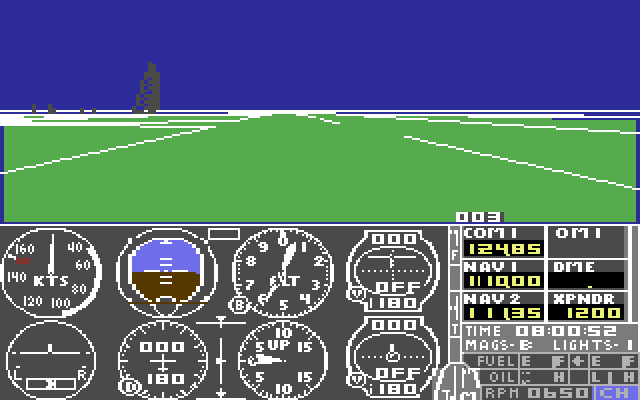

# Flight Simulator II — C64 to C90/SDL2/GLES2



A faithful port of subLOGIC's *Flight Simulator II* (Commodore 64, 1984, Bruce Artwick) to portable C90, with SDL2 for window, input and audio, and OpenGL ES 2 for display. It builds natively for macOS and for the web via Emscripten.

"Faithful" means the C source follows the original 6502 routines one by one: the same algorithms, data tables and screen output. It is not a remake. Enhancements such as higher-resolution rendering will come after the port is complete.

**Status:** the game boots, runs and flies on both targets. Most logic still runs as original 6502 code inside a purpose-built C64 model, and routines are being replaced with C one at a time (see Implementation).

## Build

Prerequisites: a C compiler, SDL2, Python 3, [VICE](https://vice-emu.sourceforge.io/) and [cc65](https://cc65.github.io/) (`brew install sdl2 vice cc65`), and [Emscripten](https://emscripten.org/) for the web build.

You also need your own copy of the original disks. Put the `.d64` images in `original-disks/`. They are never committed, and nothing extracted from them is either.

```bash
make re
```

This extracts the game from your disks: it runs the boot disk in VICE, dumps the loaded machine state, and disassembles it into `build/`.

```bash
make fs2
```

```bash
make web
```

## Run

```bash
./build/fs2
```

At the prompts, press `A` (color display) and then `B` (regular flight mode). Keys follow the physical C64 layout: Esc is RUN/STOP and Left Alt is the Commodore key. F12 saves a screenshot. The subLOGIC reference card lists the flight controls.

For the web build, serve `web/` over HTTP and open `fs2.html`. It contains data from your disks, so don't publish it.

## Implementation

- **Hybrid runtime.** `src/cpu6502.c` executes the original code inside a minimal C64 model, `src/c64.c`. The model covers `$01` banking, the VIC-II (drawn one scanline at a time so the game's raster splits look right), CIA keyboard and timers, and interrupts. `src/gfx.c` presents the 320×200 frame through GLES2.
- **Routine replacement.** `c64_add_hook()` runs a C function in place of the 6502 routine at a given address. Each ported routine must reproduce the original's effects on memory and the screen, with VICE as the reference.
- **First ported subsystem: disk I/O** (`src/diskio.c`). The loader's drive-channel routines are replaced by a small CBM DOS that reads and writes `.d64` images directly. It honors per-sector error bytes, which the scenery disks' copy protection depends on, and treats the original disks as write-protected.
- **Tools** (`tools/`): T64/D64 extractors, a disassembler that follows control flow, the VICE memory dumper, da65 glue, and `fbtest`, a headless harness that plays scripted keys and swaps disks. Reverse-engineering notes are in `docs/re-notes.md`.

## Plans

1. Disk swapping for scenery disks, and a writable user disk for saving the mode library.
2. Text-mode screens (the editor) using a character ROM from your own files.
3. Mapping the in-flight code: 3D pipeline, flight model, instruments.
4. Porting subsystems routine by routine until no 6502 code remains, then removing the interpreter.
5. SID sound.
6. After the faithful port: optional enhancements.

## Credits

- *Flight Simulator II* © 1984 subLOGIC Corporation, by Bruce Artwick. This project contains none of its code or data.
- [VICE](https://vice-emu.sourceforge.io/) for disk-accurate extraction and as the reference for verification. [cc65](https://cc65.github.io/)'s da65 disassembler.
- [SDL2](https://www.libsdl.org/) and [Emscripten](https://emscripten.org/). The build setup follows [emscripten-sdl2-ogles2](https://github.com/erik-larsen/emscripten-sdl2-ogles2).
